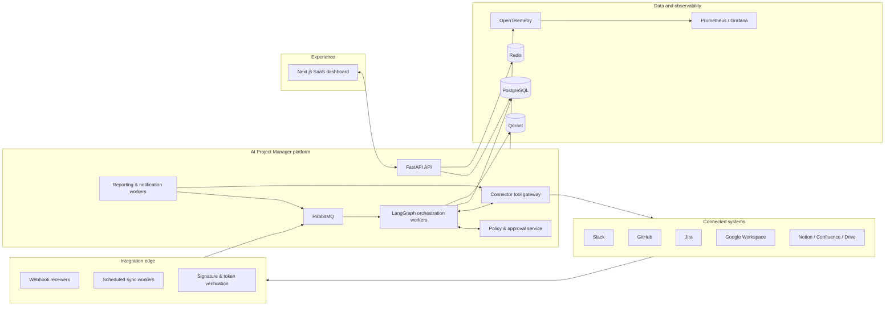
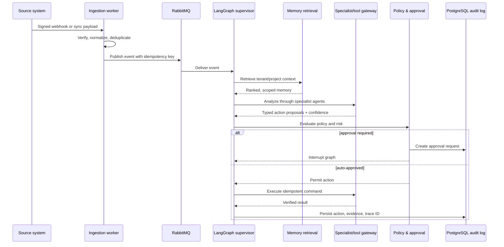

# Phase 1 — Architecture

## Objective

Define a secure, scalable, auditable foundation for an AI Project Manager that ingests engineering signals, reasons over organizational context, proposes or executes governed actions, and exposes the outcome through a SaaS dashboard.

This phase intentionally contains no application code. It is the design baseline for all later implementation phases.

## Architecture decisions

| Area | Decision | Rationale and trade-off |
| --- | --- | --- |
| Application boundary | Modular monolith with independently deployable workers | Keeps early delivery cohesive while allowing ingestion, orchestration, and reporting workloads to scale separately. Microservices are deferred to avoid distributed-transaction and operational overhead. |
| API | FastAPI, async REST, OpenAPI-first | Strong validation, Python AI ecosystem fit, and generated API documentation. REST is simpler for the dashboard than exposing agent internals. |
| UI | Next.js + React + TypeScript + Tailwind + shadcn/ui | Server-rendered SaaS shell, typed UI, and a maintainable accessible component foundation. |
| Agent runtime | LangGraph stateful workflows | Explicit routing, checkpoints, retries, human-in-the-loop interrupts, and inspectable execution paths. It introduces graph discipline but makes agent behavior governable. |
| Models | OpenAI Responses/function calling and structured outputs | Reliable tool contracts and typed decisions. A model gateway keeps a future provider change localized. |
| Relational data | PostgreSQL with tenant-scoped rows and pgcrypto | Transactional system of record, strong reporting, and reliable auditability. Qdrant is not used as a source of truth. |
| Semantic memory | Qdrant with embeddings and hybrid retrieval metadata | Scales semantic retrieval separately from transactional queries. It creates an indexing pipeline that must be monitored. |
| Cache and coordination | Redis | Low-latency cache, distributed locks, rate-limit counters, and ephemeral graph/session state. Durable facts remain in PostgreSQL. |
| Async delivery | RabbitMQ with publisher confirms, DLQ, and idempotent consumers | Decouples webhook bursts from processing and supports retries without losing work. It requires explicit idempotency keys. |
| Authorization | OAuth 2.0/OIDC plus short-lived JWT access tokens and RBAC | Works with Google login and enterprise identity. OAuth provider tokens are encrypted at rest and never exposed to agents. |
| Action governance | Policy engine + approval queue | Low-risk actions may execute automatically; external or destructive actions require policy checks and, when configured, approval. This adds latency but protects user trust. |
| Observability | OpenTelemetry traces/logs/metrics, Prometheus, Grafana | Correlates an inbound event through graph nodes and external calls. Prompt inputs are redacted before logging. |

## Logical architecture



## Agent topology

The Project Manager Agent is the graph supervisor, not a free-form executor. It receives a normalized event and may only invoke the registered specialist nodes and typed tool gateway.

| Agent | Input | Primary output | May execute external action? |
| --- | --- | --- | --- |
| Planner | Normalized event, project context | Ordered action plan with confidence | No |
| Supervisor / Project Manager | Plan, policies, current graph state | Route, retry, halt, or escalate | Only through policy gateway |
| Slack / Gmail / Meeting | Source content | Extracted work updates and action candidates | Read-only |
| GitHub | PR, issue, commit signals | Delivery evidence, linked work | Read-only |
| Jira | Ticket context and approved command | Ticket mutation result | Yes, governed |
| Standup / Reporting | Project facts and time window | Versioned summaries and metrics | Publishes only through policy |
| Notification | Approved recipient and message | Delivery receipt | Yes, governed |
| Knowledge | Documents and resolved outcomes | Memory candidates and retrieval context | Writes only through memory service |

## Canonical workflow



## Multi-tenant and security model

- Every durable record includes `organization_id`; repository queries require it and database row-level security is enabled for production roles.
- API authorization evaluates organization membership, role, project scope, and action permission. Roles: `owner`, `admin`, `manager`, `member`, `viewer`, and custom permission sets in a later iteration.
- Connector OAuth tokens and user API keys are envelope-encrypted; encryption keys live outside the database in the deployment secret manager.
- Webhooks are signature-verified, replay-protected, rate-limited, and stored as immutable raw-event references with sensitive fields redacted or encrypted.
- The tool gateway uses allowlisted connector operations, validates typed arguments, applies tenant scope, records intent/result, and blocks unapproved commands.
- Prompts, traces, and support logs redact credentials and configurable PII fields. Data retention and memory deletion are tenant-configurable.

## Reliability model

- Ingestion writes the normalized event and outbox record in one PostgreSQL transaction; an outbox publisher sends it to RabbitMQ.
- Consumers are at-least-once, use idempotency keys, and persist the completed action result before acknowledging messages.
- Retriable connector failures use exponential backoff and jitter; exhausted jobs move to a dead-letter queue and create an operator-visible incident.
- LangGraph checkpoints permit resumption after worker restart and preserve pending approval state.
- A verification node confirms external mutations with the source API where possible before marking an action successful.

## Target repository structure

```text
agentic-ai-platform/
├── apps/
│   ├── api/                         # FastAPI composition root, routers, middleware
│   ├── worker/                      # Queue consumers, scheduler, LangGraph runners
│   └── web/                         # Next.js application and SaaS UI
├── packages/
│   ├── domain/                      # Entities, value objects, policies, ports
│   ├── application/                 # Use cases, commands, queries, DTOs
│   ├── infrastructure/              # SQL, Redis, Qdrant, RabbitMQ, OpenAI adapters
│   ├── agents/                      # Graph state, nodes, prompts, evaluation contracts
│   ├── integrations/                # Slack, Jira, GitHub, Google and knowledge connectors
│   ├── contracts/                   # Shared OpenAPI/generated TypeScript clients and events
│   └── observability/               # Logging, tracing, metrics, redaction
├── migrations/                      # Alembic schema migrations
├── deploy/
│   ├── docker/                      # Production Dockerfiles
│   ├── compose/                     # Local Docker Compose environment
│   ├── kubernetes/                  # Future production manifests/Helm chart
│   └── monitoring/                  # Prometheus and Grafana provisioning
├── tests/
│   ├── unit/                        # Domain and application tests
│   ├── integration/                 # Adapters, database, queue, API tests
│   ├── contract/                    # Connector and API compatibility tests
│   └── e2e/                         # Critical user and governed-action journeys
├── docs/
│   ├── architecture/                # ADRs, diagrams, domain model
│   ├── api/                         # API conventions and generated-spec guidance
│   ├── operations/                  # Runbooks, security, deployment
│   └── product/                     # User flows and approval policy
├── scripts/                          # Safe developer automation
├── .github/workflows/               # CI/CD pipelines
└── README.md                        # Setup and architecture entry point
```

## Implementation boundaries

The first production slice will support Slack and GitHub ingestion, Jira read/update operations, approval-controlled notifications, tenant onboarding, and the dashboard activity feed. Gmail, Calendar, Teams, Discord, Linear, Notion, Confluence, Drive, full reporting, and workflow-builder capabilities follow behind stable connector and domain interfaces.

This deliberate vertical slice validates the hardest cross-cutting guarantees—tenant isolation, auditability, idempotency, policy enforcement, and resumable orchestration—before adding connectors.

## Phase 1 exit criteria

- Architecture decisions and bounded-context ownership are approved.
- Schema and API contracts are reviewed with the initial vertical slice in mind.
- Action risk policy and required approval categories are agreed.
- Repository and local development topology are accepted for Phase 2 setup.
