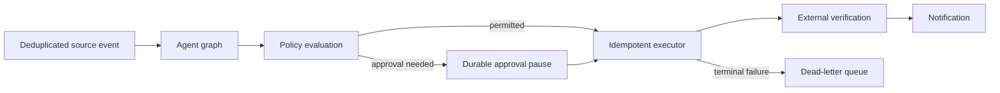

# Phase 10 — Workflow Engine

## Objective

Turn typed agent proposals into governed workflows: route events, evaluate policy, pause for approval where required, execute idempotently, verify externally, notify after verification, and send unrecoverable work to a DLQ.

## Architecture

## Design decisions

- Only proposals with a persisted idempotency key may reach an executor.
- Approval decisions resume one stored graph checkpoint exactly once.
- Notifications occur only after external verification succeeds.
- Failed work remains observable through `executed_actions`, audit logs, workflow runs, and DLQ records.

## Next steps

Implemented deterministic policy decisions and a verified execution boundary. Approval persistence/resume, provider executors, notification dispatch, and DLQ remediation will be connected through the existing workflow, approval, executed-action, notification, and dead-letter records as the UI and operator surfaces are added.
