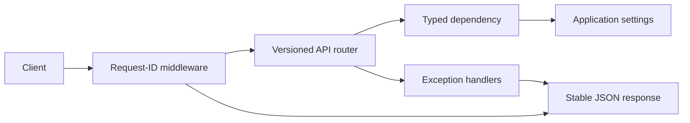

# Phase 3 — Backend Foundation

## Objective

Establish a production-oriented FastAPI boundary that subsequent domain, database, authentication, agent, and integration work can extend without changing its cross-cutting behavior.

## Architecture

`create_app()` is an application factory. It accepts typed settings when testing and loads cached environment settings in production. Routers remain separate from application composition; dependencies access instance-scoped settings rather than global mutable state.



## Folder structure

```text
apps/api/src/agentic_ai_api/
├── api/                 # Routers, schemas, and FastAPI dependencies
├── core/                # Configuration, errors, logging/correlation
└── main.py              # Application factory and HTTP composition root
apps/api/tests/          # HTTP-boundary and package smoke tests
```

## Design explanation

- `pydantic-settings` validates environment configuration at startup. Development defaults enable an empty local scaffold, while staging/production reject short secrets.
- Request IDs flow from an inbound `X-Request-ID` or are generated once, then appear in logs and every normal response.
- `APIError` and validation failures are normalized into the public error contract defined in the API specification. Unexpected errors are logged without exposing internals.
- Liveness proves the process is running; readiness reports only checks that are actually implemented. Database/cache/queue probes are intentionally deferred until their Phase 4/10 adapters exist.
- CORS is disabled unless explicit origin configuration is provided.

## Code implementation

Implemented the FastAPI app factory, typed settings, logging filter, request ID middleware, health router, dependency provider, stable error schemas/handlers, and API tests.

## Testing

The test suite covers liveness, readiness, request-ID propagation, and package importability. The configured commands are `uv run ruff check .`, `uv run mypy src`, and `uv run pytest` from `apps/api`.

Python and uv are not installed in the current workspace environment, so these commands could not be executed locally; they remain CI checks.

## Documentation

The API package README now contains local startup and endpoint details. The authoritative error-envelope and endpoint conventions remain in `docs/api/api-specification.md`.

## Next steps

Phase 4 will introduce Alembic, PostgreSQL connectivity, tenant-aware repository conventions, row-level security, transactional outbox support, and integration tests against the local database container.
