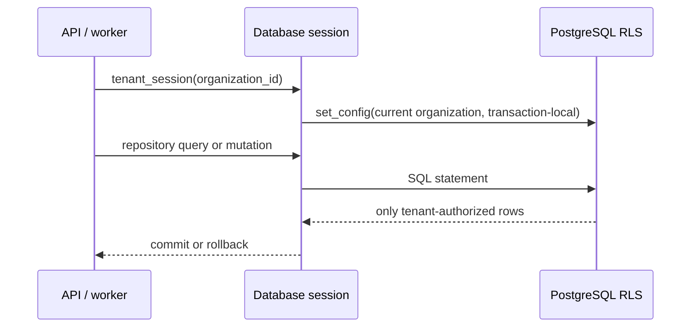

# Phase 4 — Database

## Objective

Implement the durable, tenant-isolated system of record and the migration workflow required for governed automation.

## Architecture

PostgreSQL is accessed through SQLAlchemy 2.x asynchronous sessions. A `Database` lifecycle owner constructs a pooled engine, verifies it during application startup, and disposes it on shutdown. Readiness now returns `503` if an enabled database is unreachable.

Each request/job that operates on tenant data must use `tenant_session(organization_id)`. That helper sets PostgreSQL's transaction-local `app.current_organization_id`, and row-level-security policies enforce the same constraint in the database.



## Folder structure

```text
apps/api/migrations/                 # Alembic environment and immutable revisions
apps/api/migrations/versions/        # Applied database schema history
apps/api/src/.../domain/models.py    # SQLAlchemy core entity mappings
apps/api/src/.../infrastructure/     # Database lifecycle and repositories
```

## Design explanation

- Migrations are immutable Alembic revisions, not application-startup `create_all` calls. This keeps production changes reviewable and reversible.
- IDs are generated as UUIDv7 in the application so values are time-sortable without relying on database-specific extensions for ID generation.
- A transactional outbox table is included in the same database transaction as source-event processing; Phase 10 will publish it to RabbitMQ.
- External action idempotency is enforced by a unique `executed_actions.idempotency_key`.
- Qdrant stores vectors only. PostgreSQL retains the tenant-authorized `memories` record and Qdrant point reference.

## Code implementation

Implemented an async SQLAlchemy database owner, tenant-scoped session helper, reusable tenant repository base, core ORM mappings, Alembic async configuration, and two schema revisions.

The schema covers tenant identity, projects/teams/sprints, work items, messages and meetings, workflow/approval/action state, connector credentials, audit/outbox/DLQ records, and knowledge/prompt memory records.

## Testing

Unit coverage includes UUIDv7 conformance, package imports, and the readiness contract with database access disabled. Migration integration testing requires a running PostgreSQL container and is documented below.

```powershell
Set-Location apps/api
uv sync --all-groups
uv run alembic upgrade head
uv run pytest
```

## Documentation

The Phase 1 [database schema](database-schema.md) remains the conceptual model. Alembic revisions are now the executable implementation. The local environment guide contains PostgreSQL startup instructions.

## Next steps

Phase 5 adds Google OAuth, access/refresh token lifecycle, organization onboarding, RBAC authorization, encrypted connector credentials, and audit events.
