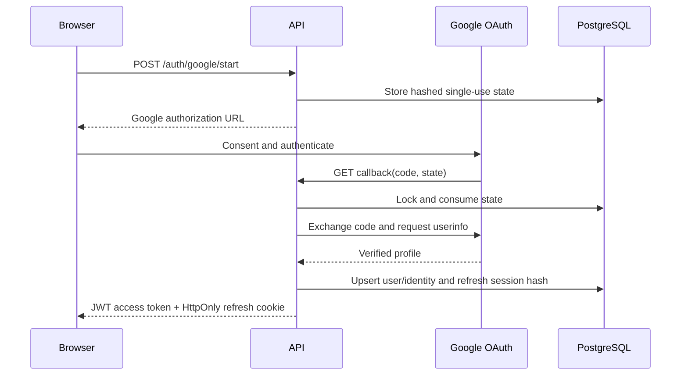

# Phase 5 — Authentication and Authorization

## Objective

Provide secure Google sign-in, short-lived API access, refresh-session rotation, revocation, and reusable authorization boundaries for the multi-tenant platform.

## Architecture



## Folder structure

```text
apps/api/src/agentic_ai_api/auth/      # Token, credential cipher, Google OAuth, RBAC primitive
apps/api/src/agentic_ai_api/api/routers/auth.py
apps/api/migrations/versions/          # OAuth state, identity, and session schema
apps/api/tests/test_auth_security.py
```

## Design explanation

- Google authorization state is a high-entropy opaque value stored only as an HMAC hash, expires after ten minutes, and is locked/consumed exactly once.
- Google code exchange uses the server-side client secret, followed by Google OpenID userinfo retrieval; only email-verified profiles are accepted.
- Access tokens are signed JWTs with issuer, audience, expiry, subject, and refresh-session ID. They last 15 minutes by default.
- Refresh tokens are high-entropy opaque values held only in an HttpOnly, SameSite cookie. PostgreSQL stores a keyed hash, rotates it on use, and allows the linked session to be revoked.
- Connector credentials use Fernet authenticated encryption before persistence. Production configuration rejects sample or missing credentials/secrets.
- RBAC is deliberately separated from authentication. The reusable role guard is ready for organization-scoped API routes introduced with onboarding and project features.

## Code implementation

Implemented Google OAuth start/callback routes, refresh, logout, and `GET /auth/me`; JWT/refresh cryptography; encrypted credential primitive; external-identity, OAuth-state, and auth-session models; and an Alembic migration.

## Testing

Token and credential-encryption unit tests have been added. Run from `apps/api`:

```powershell
uv sync --all-groups
uv run alembic upgrade head
uv run ruff check .
uv run mypy src
uv run pytest
```

## Documentation

Configure `GOOGLE_CLIENT_ID`, `GOOGLE_CLIENT_SECRET`, a production redirect URI, strong `JWT_SECRET_KEY`, a valid Fernet `ENCRYPTION_KEY`, and `AUTH_COOKIE_SECURE=true` before non-development use.

## Next steps

Phase 6 introduces the model gateway, prompt registry, structured outputs, function-calling contracts, model fallback, and evaluation boundaries.
