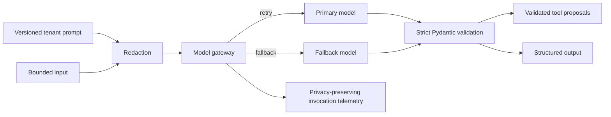

# Phase 6 — LLM Integration

## Objective

Introduce a secure, testable model boundary that converts bounded project-management inputs into validated proposals. It does not execute tools or make workflow decisions; those responsibilities begin with the LangGraph and policy phases.

## Architecture



## Folder structure

```text
apps/api/src/agentic_ai_api/llm/ # Gateway, contracts, redaction, prompts, and evaluation harness
apps/api/migrations/versions/    # Invocation-telemetry migration
apps/api/tests/                  # Mocked gateway and contract tests
```

## Design explanation

- The gateway uses the OpenAI Responses API and requests strict JSON Schema output derived from Pydantic models. The model output is still validated locally, so malformed or incomplete data cannot cross the boundary.
- Prompt templates are tenant-scoped and versioned. Callers reference an exact prompt record, which lets evaluations and audit trails reproduce a behavioral change without storing model inputs or outputs.
- Tool definitions are declarative JSON schemas. A model may only propose a declared and validated call; it cannot execute it through this layer.
- Credentials and direct email identifiers are redacted before outbound calls by default. Invocation telemetry stores only response IDs, model, status, token counts, latency, error code, and trace ID.
- A bounded exponential retry is applied to the primary model, then the configured fallback. Exhaustion fails closed with `ModelGatewayError`.

## Code implementation

The `llm` package provides `OpenAIModelGateway`, `ModelRequest`, `ModelResult`, strict tool contracts, prompt lookup/rendering, a conservative redactor, and a CI-ready evaluation function. `model_invocations` adds tenant-RLS-protected operational telemetry.

## Testing

Run from `apps/api`:

```powershell
uv sync --all-groups
uv run alembic upgrade head
uv run ruff check .
uv run mypy src
uv run pytest
```

## Documentation

Set `OPENAI_API_KEY` for staging and production. Configure `LLM_PRIMARY_MODEL`, `LLM_FALLBACK_MODEL`, output limits, retry count, timeout, and `LLM_REDACT_PII` through environment variables. The Responses API supports both function calling and structured outputs; the gateway uses strict JSON Schema for each response contract.

## Next steps

Phase 7 will use the gateway from LangGraph planner, supervisor, and specialist nodes, with checkpointing and confidence policies.
