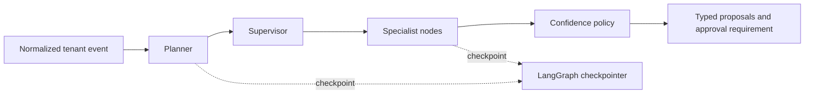

# Phase 7 — Agent Framework

## Objective

Implement an inspectable LangGraph workflow that plans work, coordinates specialist analysis, and applies a confidence/risk policy to typed proposals without executing external actions.

## Architecture



## Folder structure

```text
apps/api/src/agentic_ai_api/agents/ # Graph state, contracts, model adapters, and topology
apps/api/tests/test_agent_graph.py  # Deterministic graph and retry behavior
```

## Design explanation

- `AgentGraphFactory` creates planner, supervisor, specialist, and confidence-policy nodes. All node state is JSON-serializable and tenant-scoped by `organization_id`.
- `GatewayAgentServices` invokes the Phase 6 model gateway with a distinct prompt contract for the planner and each specialist. Tests use an `AgentServices` fake instead, keeping graph tests deterministic.
- The graph accepts an injected checkpointer. Development can use `InMemorySaver`; the worker deployment must inject a durable PostgreSQL-backed saver before production event processing. A workflow run UUID becomes the LangGraph `thread_id`.
- Planner and specialist nodes have bounded LangGraph retry policies. They are analysis-only and have no external side effects, so a retried or resumed node cannot mutate Jira, Slack, GitHub, or notifications.
- Low-confidence plans skip specialist work and are marked `needs_review`. Every medium/high-risk proposal or proposal below the auto-approval threshold requires human approval. This phase emits the decision only; Phase 10 will add approval interrupts and action execution.

## Code implementation

Implemented typed plan/proposal contracts, a gateway-backed planner/specialist service adapter, LangGraph topology with checkpoint injection and retry policies, and deterministic confidence policy routing.

## Testing

Run from `apps/api`:

```powershell
uv sync --all-groups
uv run pytest tests/test_agent_graph.py
uv run ruff check src/agentic_ai_api/agents tests/test_agent_graph.py
```

## Documentation

The implementation uses LangGraph checkpoints as thread-scoped recovery state. Checkpoints must use a durable saver in production; in-memory checkpoints are only suitable for development and tests. See the [LangGraph checkpoint reference](https://langchain-ai.github.io/langgraph/reference/checkpoints/) and [persistence guidance](https://langchain-ai.github.io/langgraph/cloud/concepts/threads/).

## Next steps

Phase 8 adds long-term memory extraction, Qdrant indexing, hybrid retrieval, authorization filtering, and retention controls.
