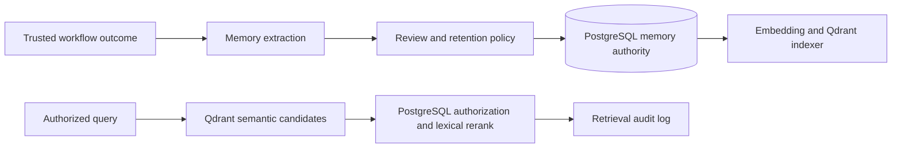

# Phase 8 — Long-Term Memory

## Objective

Build governed long-term organizational memory: extract candidates from trusted workflow outcomes, review them, index approved records in Qdrant, and retrieve only records authorized for the requesting tenant and access scope.

## Architecture



## Folder structure

```text
apps/api/src/agentic_ai_api/memory/ # Candidate, retrieval, and indexing contracts
apps/api/migrations/versions/        # Governed-memory metadata and retrieval audit schema
```

## Design explanation

- PostgreSQL is authoritative for memory content, review status, retention, and access tags. Qdrant holds only a derived point ID, vector, and non-sensitive retrieval payload.
- `MemoryCandidate` defaults to `pending_review`; rejected, expired, and deleted records must never be indexed or returned.
- Every vector result is re-authorized from PostgreSQL before use. This prevents an index payload or stale point from granting access beyond the current tenant, project, or access tags.
- The selected embedding model is `text-embedding-3-small`; it provides numerical text representations suitable for relatedness/search. Qdrant supports vector payload filters and hybrid search, which will be used only as a candidate/ranking layer.
- Retrieval results are logged with workflow context, rank, and score so relevance can be evaluated and audited without retaining prompts.

## Code implementation

Implemented the OpenAI embedding provider, Qdrant derived-index adapter, reviewed-memory service, authoritative PostgreSQL re-authorization, lexical/semantic fusion, retrieval audit logs, and expiry purge.

## Testing

Focused tests cover project/tag authorization and hybrid ranking; mocked provider/index tests can extend this with transport failure scenarios.

## Documentation

See [OpenAI embeddings](https://developers.openai.com/api/docs/models/text-embedding-3-small) and [Qdrant hybrid search](https://qdrant.tech/documentation/search/text-search/hybrid-search/) for the underlying provider capabilities.

## Next steps

Phase 9 adds Slack, GitHub, and Jira connector integrations.
